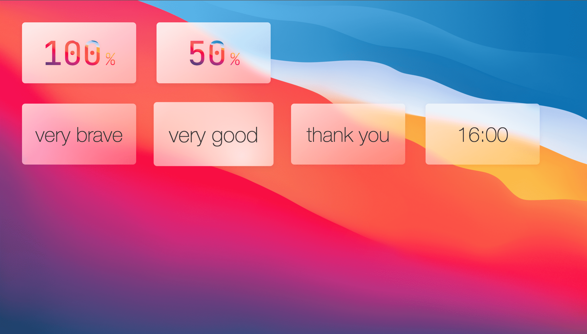
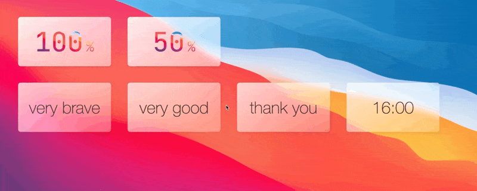

# Glassmorphic UI Demo

This is a **proof-of-concept** for glassmorphism-style UI designs for the web.

- [Demo at glassmorphic.netlify.app](https://glassmorphic.netlify.app)

## Features

- Mouse tracking for hover light effects
- Blur and saturation with `backdrop-filter: blur() saturate()`
- Text clipping mask with `background-clip: text`
- Translucent cards, similar to vibrancy in macOS
- Scale transitions on hover
- Rounded Corners
- Responsive
- Transition on viewport size change
